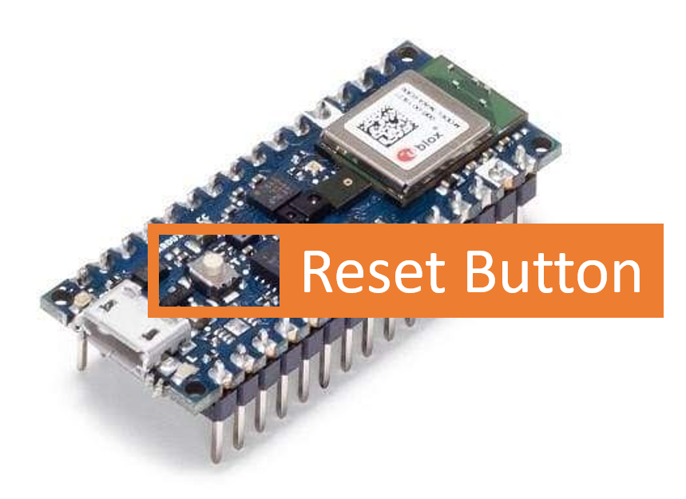
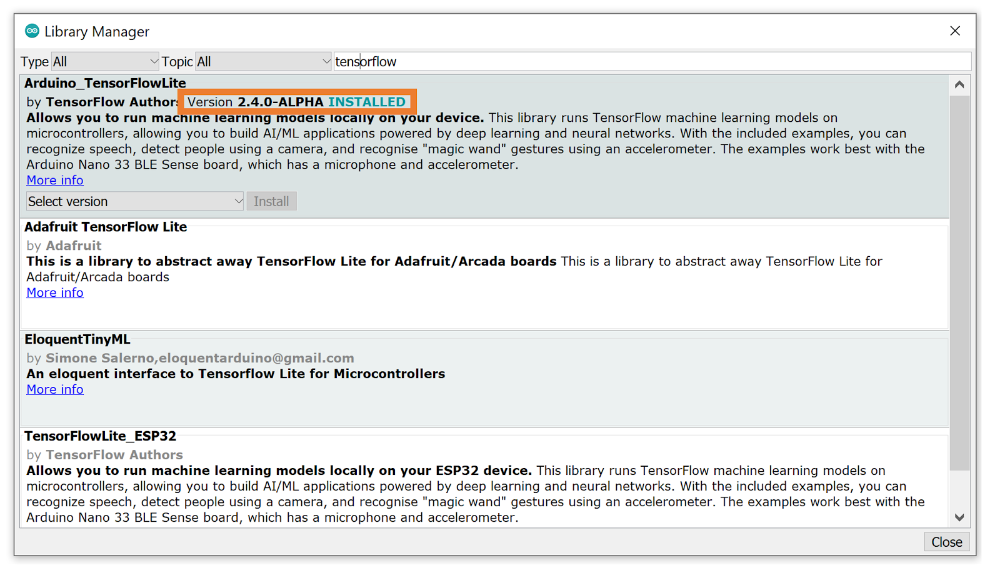
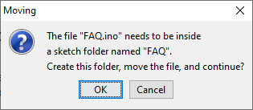
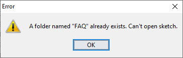
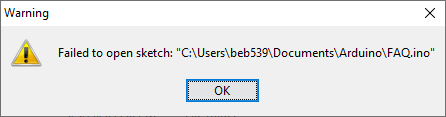

## Common Arduino Errors FAQ

### I cannot upload code / device not found on listed ports

1. First ensure that the following are true:
    
    a. The microcontroller is plugged into your machine
    
    b. You are using the provided USB cable or a functional USB cable that isn’t intended solely for power delivery (that is, capable of data exchange)
    
    c. You haven’t introduced a defective USB hub or adaptor between the microcontroller board and your machine.
    
    d. You have selected the correct Board and Port.

    e. The protective foam is removed from the board. It is a common mistake to think that the protective foam that comes with the box is not conductive and therefore it can stay attached to the pins as the board is functioning. The foam is slightly conductive and can cause malfunctions and undesired behaviours (unwanted resets, interferences...) when kept attached to the pins. The foam needs to be slightly conductive to protect the board from ESD during shipping, but it needs to be removed before the board gets powered on.

    f. You have installed the correct version of the board files. Go back to the Setting up the Software reading and make sure you installed the correct version from the board manager. Remember, the reading will have the most up to date versions of everything but we may not be able to update the videos overtime.

2. If all of the above are satisfied then you may need to manually put your board into **Bootloader mode** in order to upload code. This happens from time to time and is nothing to worry about. To activate Bootloader mode simply double tap the small white RESET button. The orange built-in LED on the board will fade in and out. Do note that on some operating systems, the board may increment to a different serial port.

    Once the LED is fading on and off, try to upload the sketch again. Check if the sketch was uploaded correctly and if the LED is blinking as expected. Note the difference between fading (in bootloader mode listening for new code) and blinking (sketch successfully uploaded)
    
    
    
    Finally, once you successfully upload code, you may need to press the reset button one more time to exit bootloader mode, if it doesn’t do that automatically, and you may need to reselect the Port after you do that.
    
    So in summary: **double tap reset → upload → single tap reset** and you should be ready to go!
    
### Board at \<serial port\> not available, upload error
1. First ensure that the following are true:
    
    a. The microcontroller is plugged into your machine
    
    b. You are using the provided USB cable or a functional USB cable that isn’t intended solely for power delivery (that is, capable of data exchange)
    
    c. You haven’t introduced a defective USB hub or adaptor between the microcontroller board and your machine.
    
    d. You have selected the correct Board and Port.

2. If those are all satisfied then be sure that there aren’t other applications competing for access to your MCU over the same serial port — namely, that the Serial Monitor and Serial Plotter are closed for upload (We’ll explore both of those in more detail in the course).

### What Arduino software versions do I need to install?

We have tested the TinyML kit on the following:
+ Arduino IDE version 1.8.13
+ Arduino mbed-enabled board files version 1.3.1
+ TensorFlow Lite for Microcontrollers Arudino library version 2.4.0-ALPHA
+ Arduino_LSM9DS1 Arudino library version 1.1.0
+ ArduinoBLE version Arudino library 1.1.3
+ Havrard_TinyMLx Arudino library version 0.1.0

### How do I know what version of \<Arduino Library\> is installed?

Use the menu to navigate to: ```Tools → Manage Libraries```. Then type the name of the library in the top search bar and you will see the word ```INSTALLED``` in teal next to the version number of the library installed. For example you might find the below:



### How do I know what version of the \<Arduino Board Files\> are installed?

Use the menu to navigate to: ```Tools → Board: → Boards Manager```. Then type the name of the board files in the top search bar and you will see the word ```INSTALLED``` in teal next to the version number of the board files. (See the image of the Library Manager above for an example).


### Unable to open a sketch in the Arduino IDE

The Arduino IDE requires every sketch (.ino file) to be stored in a folder with the same name as the file, e.g. “blink.ino” needs to be stored in a folder called “blink”. When you try to open a sketch that is not already in a folder with the same name, the IDE will attempt to create the appropriate folder and move the sketch before opening, indicated by the following pop-up:



If a folder with the name of your sketch already exists in the current directory, you will get the error messages below (one after the other):





To fix this, simply move or delete the conflicting directory (in this case, a directory called “FAQ”), then either try opening the sketch again, or manually create a folder with the sketch name and move the sketch into that folder then open the sketch.

### I'm running Linux and I can't seem to access the serial port to upload my code.

We haven't tested all flavors of Linux but the following generally solves any issues faced when running Ubuntu Linux (Versions 16.04, 18.04, and 20.04):

1. Add yourself to the ```dialout``` user group to get access to the serial port. To do that run ```sudo usermod -aG dialout <USER_NAME>``` and then logout and then log back in. Now your user should have the correct permissions.

2. ```chmod``` the serial port as follows: ```sudo chmod a+rw <SERIAL_PORT>```.

3. If you still cannot access the serial port, you may have the ```modemmanager``` package installed and set to auto-capture all serial devices. This package is used for cellular connections from your laptop. If you are not using your laptop for cellular you can remove the package with ```sudo apt-get purge modemmanager```.
