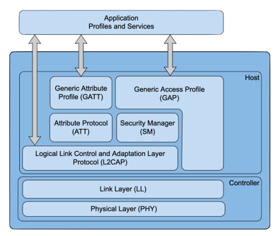

## Bluetooth Low Energy (BLE)

The [BLE Specification](https://learn.adafruit.com/introduction-to-bluetooth-low-energy/introduction) was created in 2011 to trasmit information as needed, rather than in a continuous stream, saving energy. In the next few paragraphs, we’ll cover some technical concepts and discuss the practical requirements to start using BLE.

For your system to employ BLE, there are two roles for it to fill: one in which its BLE module handles forming connections with other devices and a second in which it handles communication itself, data transfer, for a connection made. These considerations live within the Generic Access Profile (GAP) and Generic Attribute Profile (GATT) layers of the BLE stack, pictured here, which are application adjacent. Conceptually, the BLE module can take on the role of either a central or peripheral GAP device. Peripherals periodically send out advertisements that state what they are and what services they can offer, where services is a loaded term conveying the type of data they can share, individually referred to as characteristics of a particular service. Meanwhile, central devices can choose to scan for peripherals and initiate a connection when they find a device or service they care to learn more about in forming a connection. 

[](https://infocenter.nordicsemi.com/index.jsp?topic=%2Fsds_s132%2FSDS%2Fs1xx%2Fble_protocol_stack%2Fble_protocol_stack.html)

There are three device states, then: idle (not advertising or scanning), discovery (advertising, scanning, or initiating a connection), and connected, at which point we shift our perspective to GATT roles in a traditional client, server relationship. It’s worth noting that while many GAP peripherals go on to be GATT servers and GAP centrals go on to be GATT clients, this is not necessarily true. Regardless, if you want your embedded device to be able to convey the results of some TFLM model, you can form a new service with a collection of related characteristics dedicated to organizing those variables, each with its own set of permissions (read and write, for example). 

Each new service and characteristic is tagged by a 128-bit universally unique identification number (UUID), which you can generate [here](https://www.guidgenerator.com/online-guid-generator.aspx). If you structure your embedded system as a GAP peripheral, which is common for embedded systems, you can then program whichever central device to scan specifically for your TFLM service UUID. With a connection formed, the client to your embedded server can then read from the characteristics you defined for your model return and form a very brief connection just long enough to retrieve said datum to minimize the energy requirement of RF transmission. Cleverly enough, if a characteristic is defined with a ‘notify’ permission, a client can subscribe to said characteristic and when its server updates the value associated with that characteristic, the client will be, you guessed it, notified. 

While some level of familiarity with the details of the previous paragraph is required to effectively call on the Nano’s BLE module, the [ArduinoBLE](https://www.arduino.cc/en/Reference/ArduinoBLE) library you installed fortunately abstracts away all but the most critical parameters, in offering up five classes which we will use in our Magic Wand example later in this course:
+ BLE - for low level module control
+ BLEDevice - used to get information about connected / discovered devices
+ BLEService - used to handle or inquiry services it provides or sees on other devices
+ BLECharacteristic - interact with characteristics, on one side or the other
+ BLEDescriptor - used to describe the characteristics that the board offers

If you can’t wait to get your feet wet exploring BLE, we suggest you deploy a simple LED hello world BLE example. 
1. You can find that example by navigating in the Arduino IDE to: ```Files → Examples → ArduinoBLE → Peripheral → LED```.
2. Make sure to set the Port and Board from the Tools menu.
3. Click upload to compile and flash your code to your Arduino. If you are having problems check out our [Arduino FAQ](https://github.com/tinyMLx/appendix/blob/main/ArduinoFAQ.md) appendix.
4. Once the code is uploaded open the serial monitor to start the BLE on your Arduino.
5. From there you can manipulate the state of the built-in LED using the LightBlue app from PunchThrough. LightBlue is available on both [iOS](https://play.google.com/store/apps/details?id=com.punchthrough.lightblueexplorer&hl=en_US&gl=US) and [Android](https://play.google.com/store/apps/details?id=com.punchthrough.lightblueexplorer&hl=en_US&gl=US). 
6. Open up the app and give it access to Bluetooth then in the list of BLE devices look for either ```LED``` or ```Arduino``` and click on it. You should then see the serial monitor say ```Connected to central: XX:XX:XX:XX:XX:XX```.
7. Then click on the option that probably has a very long UUID and the option for ```Properties:Read Write```. Then click on ```Write new value```. You can now send a ```1``` to turn on the LED or a ```0``` to turn it off!


You may find [this related tutorial](https://www.arduino.cc/en/Guide/MKRWiFi1010/enabling-ble) helpful, despite its use of another development board and discrete, off-board LED — all of the important considerations are common!
