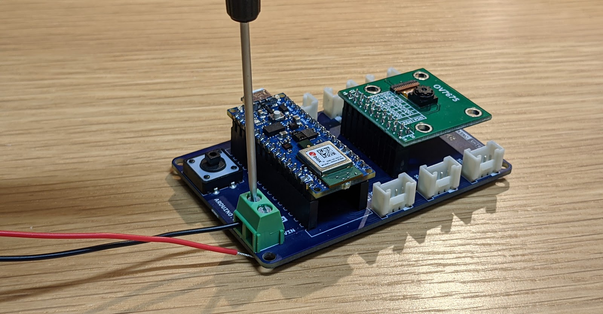
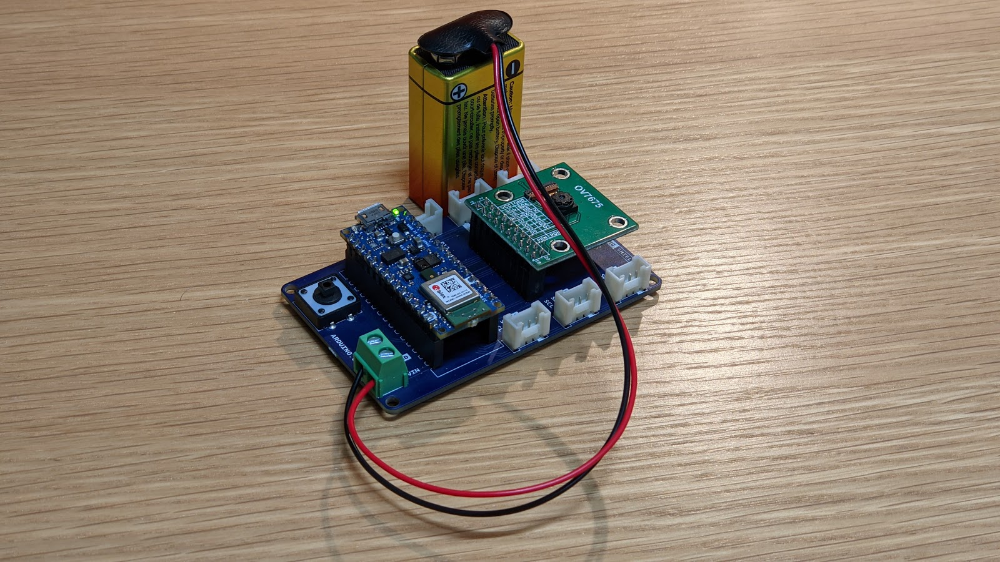

## Powering Your TinyML System

Now that you have your Arduino development board up and running, let's talk about how you could deploy it independent of your computer! While some embedded systems call on AC-DC converters (or “wall warts,” colloquially) to provide low voltage power to their electronics (the Google home speaker, for example), others are battery powered. Both of these paradigms are applicable to real-world deployment of tinyML and both are achievable using your TinyML kit. 

### USB Power Delivery

To this point, we have provided power over USB to our microcontroller via the microB port on the Nano 33 BLE Sense. The 5V that USB carries is then down regulated on the development board to 3.3V, the logical reference for the MCU. While there’s nothing wrong with this in development, a prototype of your application ought not depend on drawing power from your computer. Instead, you could call on an AC-DC converter with USB output. This has the added benefit of likely raising the current capacity of the 5V power rail, from at most 500 mA via a computer to whatever the specification happens to be for a given wall-bound converter. This could be meaningful for driving certain power hungry actuators, like speakers. 

### Battery

While the above solution removes the need for the computer, you’re still tethered to a wall. To go fully mobile you’ll want to call on a battery. So what are our options? The idea of using a voltage regulator (specifically, the [MPM3610](https://www.monolithicpower.com/en/documentview/productdocument/index/version/2/document_type/Datasheet/lang/en/sku/MPM3610GQV/document_id/2090)) to cut down an input voltage to a nice, stable 3.3V level applies here as well. If you were to take a closer look at the linked datasheet, you’d find that the MPM3610 accepts input voltages from 4.5V to 21V. The 5V delivered over USB is within this range, and any compatible battery will need to be as well. This unfortunately eliminates the possibility of calling on single cell 3.7V lithium batteries, but makes the selection of a [9V alkaline battery](https://commons.wikimedia.org/wiki/File:Duracell_9_Volt_0849.jpg) fairly obvious. 

You might be wondering how any battery might connect to the boards in front of you, but never fear, we’ve got you covered. At one corner of the Tiny Machine Learning Shield you’ll find a green terminal block with silkscreen labels that read, “VIN” and “GND,” where GND is our reference voltage and as such should be connected to the negative terminal of any compatible battery. This green terminal block is where you’d want to screw in wires carrying 4.5V to 21V, and we’ll add that 9V clip, [like this](https://www.digikey.com/en/products/detail/mpd-memory-protection-devices/BS6I/32055), that terminates in pre-stripped hook-up wire makes this quite easy!

#### Assembly Steps
1. Screw down a wire leading from the negative battery terminal (black) to GND (Most < 3mm flat-head screwdrivers will suffice here).
2. Repeat this process for the positive battery terminal (red) to VIN. And that's it you're all set to power your Arduino from a battery!

#### Important Notes
1. While there is clever circuitry on board to handle such an exception, it is generally good practice to avoid having competing power sources, so we’d recommend that you unplug the Nano 33 BLE Sense from USB power before connecting a battery

2. With about 550 mAh capacity, a 9V battery can source 15 mA for about 37 hours before you will need to get a new one.

